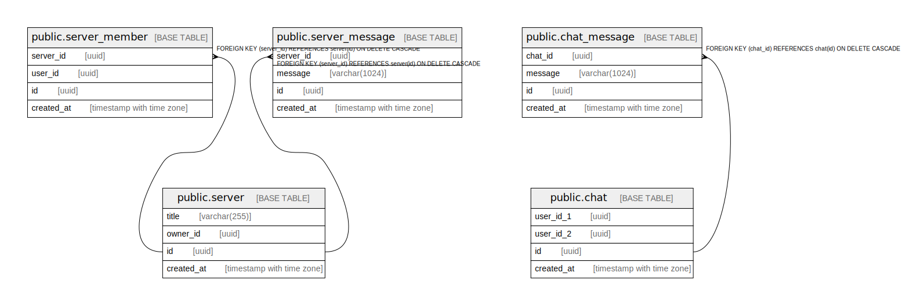

# chat_service

## Tables

| Name | Columns | Comment | Type |
| ---- | ------- | ------- | ---- |
| [public.server](public.server.md) | 4 |  | BASE TABLE |
| [public.chat](public.chat.md) | 4 |  | BASE TABLE |
| [public.server_member](public.server_member.md) | 4 |  | BASE TABLE |
| [public.chat_message](public.chat_message.md) | 4 |  | BASE TABLE |
| [public.server_message](public.server_message.md) | 4 |  | BASE TABLE |

## Relations

---

> Generated by [tbls](https://github.com/k1LoW/tbls)
