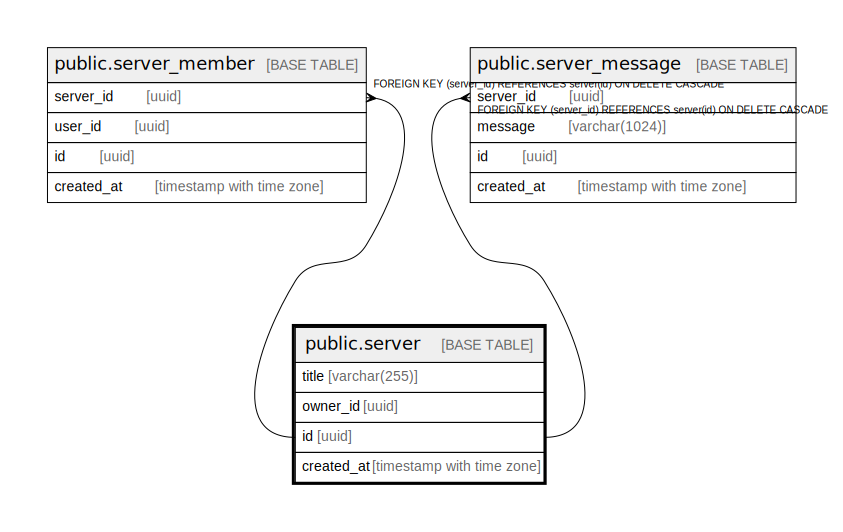

# public.server

## Description

## Columns

| Name | Type | Default | Nullable | Children | Parents | Comment |
| ---- | ---- | ------- | -------- | -------- | ------- | ------- |
| title | varchar(255) |  | false |  |  |  |
| owner_id | uuid |  | false |  |  |  |
| id | uuid |  | false | [public.server_member](public.server_member.md) [public.server_message](public.server_message.md) |  |  |
| created_at | timestamp with time zone |  | false |  |  |  |

## Constraints

| Name | Type | Definition |
| ---- | ---- | ---------- |
| server_pkey | PRIMARY KEY | PRIMARY KEY (id) |
| server_title_key | UNIQUE | UNIQUE (title) |

## Indexes

| Name | Definition |
| ---- | ---------- |
| server_pkey | CREATE UNIQUE INDEX server_pkey ON public.server USING btree (id) |
| server_title_key | CREATE UNIQUE INDEX server_title_key ON public.server USING btree (title) |

## Relations

---

> Generated by [tbls](https://github.com/k1LoW/tbls)
