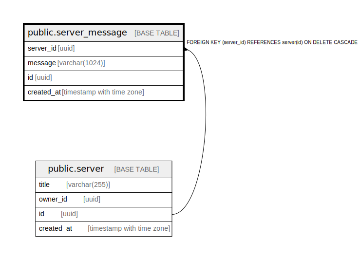

# public.server_message

## Description

## Columns

| Name | Type | Default | Nullable | Children | Parents | Comment |
| ---- | ---- | ------- | -------- | -------- | ------- | ------- |
| server_id | uuid |  | false |  | [public.server](public.server.md) |  |
| message | varchar(1024) |  | false |  |  |  |
| id | uuid |  | false |  |  |  |
| created_at | timestamp with time zone |  | false |  |  |  |

## Constraints

| Name | Type | Definition |
| ---- | ---- | ---------- |
| server_message_server_id_fkey | FOREIGN KEY | FOREIGN KEY (server_id) REFERENCES server(id) ON DELETE CASCADE |
| server_message_pkey | PRIMARY KEY | PRIMARY KEY (id) |

## Indexes

| Name | Definition |
| ---- | ---------- |
| server_message_pkey | CREATE UNIQUE INDEX server_message_pkey ON public.server_message USING btree (id) |

## Relations

---

> Generated by [tbls](https://github.com/k1LoW/tbls)
